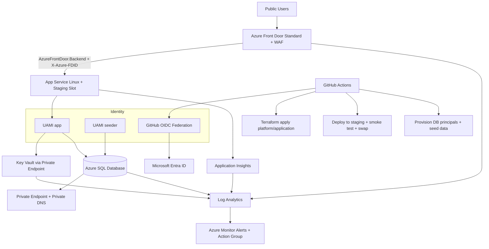

# Implementation Architecture Diagram

```mermaid
flowchart TB
  Users[Public Users] --> AFD[Azure Front Door Standard + WAF]
  AFD -->|AzureFrontDoor.Backend + X-Azure-FDID| App[App Service Linux + Staging Slot]

  subgraph Identity
    AppUAMI[UAMI app]
    SeederUAMI[UAMI seeder]
    OIDC[GitHub OIDC Federation]
  end

  App --> AppUAMI
  AppUAMI --> KV[Key Vault via Private Endpoint]
  AppUAMI --> SQL[(Azure SQL Database)]

  SeederUAMI --> SQL
  SQL --> PE[Private Endpoint + Private DNS]

  GH[GitHub Actions] --> OIDC
  OIDC --> Azure[Microsoft Entra ID]
  GH --> TF[Terraform apply platform/application]
  GH --> Deploy[Deploy to staging + smoke test + swap]
  GH --> Seed[Provision DB principals + seed data]

  App --> AI[Application Insights]
  AFD --> LAW[Log Analytics]
  KV --> LAW
  SQL --> LAW
  AI --> LAW
  LAW --> Alerts[Azure Monitor Alerts + Action Group]
```
