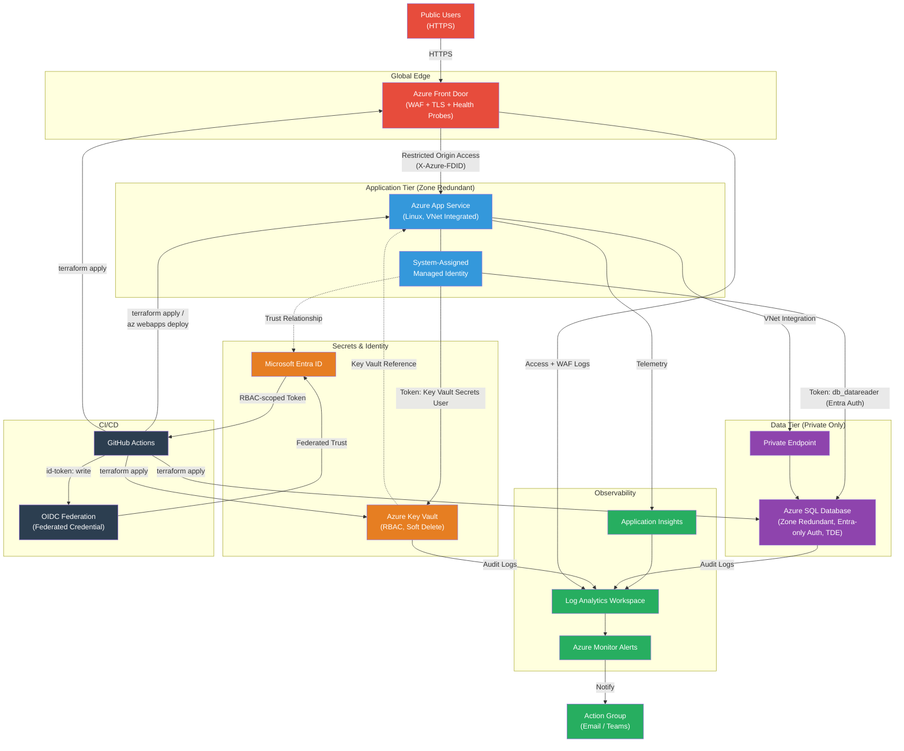

# Architecture.md — Quote of the Day: Secure, Highly Available Azure Web Application

**Document status:** Implementation Blueprint (v1.0)
**Audience:** GitHub Copilot Agent (implementer), Reviewers, Interview Panel
**Target effort:** ~5 hours senior platform engineer time, delivered within 5 business days

---

## 1. Executive Summary

This document defines the architecture for a public web application that serves a random famous quote on every page load, backed by an Azure SQL Database, deployed entirely via Terraform, and operated with production-grade security and availability practices — scoped intentionally to fit a ~5 hour build.

**Proposed solution:** A single-region-primary, multi-AZ (zone-redundant) deployment consisting of:

- **Azure App Service (Linux, Premium v3)** hosting a minimal Node.js Express API + static frontend, scaled across **Availability Zones**.
- **Azure SQL Database (General Purpose, Zone Redundant)** storing the quotes table, reached exclusively via **Private Endpoint**.
- **Azure Front Door (Standard/Premium)** as the global public entry point, providing TLS termination, WAF, caching, and health-probe-based failover.
- **Azure Key Vault** for all secrets/connection strings, accessed via **Managed Identity** (no credentials in code or config).
- **Azure Monitor, Log Analytics, and Application Insights** for unified observability, alerting, and dashboards.
- **Microsoft Entra ID** as the identity backbone for both human RBAC access and workload identity (App Service → Key Vault → SQL) and for **GitHub Actions OIDC federation** (no stored cloud secrets in CI/CD).
- **Terraform** as the sole provisioning mechanism, structured into bootstrap/platform/application layers with reusable modules and remote state in Azure Storage.

**Why this solution was selected:** It uses exactly the Azure services mandated by the assessment (App Service, Azure SQL, Key Vault, Monitor, Log Analytics, App Insights, Managed Identity, Front Door, Private Endpoints, Entra ID), is achievable by one engineer in ~5 hours because App Service and Azure SQL PaaS abstract away compute/patching/clustering, and still demonstrates senior-level judgement: private networking, zero standing secrets, zone redundancy, and a fully automated OIDC-based CI/CD pipeline. It intentionally avoids AKS, Cosmos DB, VNet-heavy hub-spoke topologies, and multi-region active-active — these would materially increase build time and operational surface without adding proportional value for a "display a random quote" workload, and that trade-off is documented explicitly in Section 4 and Section 6.

**How it satisfies the assessment requirements:**

| Requirement | How it's satisfied |
|---|---|
| Public application | Azure Front Door public anycast endpoint, custom domain-ready, WAF-protected |
| Database connectivity | App Service → Azure SQL over Private Endpoint using Managed Identity (Entra-only auth) |
| PII handling | All quote data treated as confidential: encryption at rest (TDE), in transit (TLS 1.2+), private-only DB access, Key Vault-managed secrets, auditing enabled |
| High availability | Zone-redundant App Service Plan (min 2 instances across zones), Zone-redundant Azure SQL, Front Door with health probes and automatic failover, 99.95%+ composite SLA |
| Terraform-first | 100% of infrastructure defined in Terraform (no ClickOps); modular, environment-parameterized, remote state with locking |
| Azure-native services | Uses only first-party Azure PaaS services, no third-party dependencies |
| AI-assisted delivery | GitHub Copilot used for architecture drafting, Terraform module scaffolding, GitHub Actions authoring, security review, and documentation generation — fully disclosed in Section 15 |

---

## 2. Functional Requirements

| ID | Requirement |
|---|---|
| FR-1 | The application MUST be publicly accessible over HTTPS. |
| FR-2 | On every page load / API call, the application MUST return one random quote from the database. |
| FR-3 | The database MUST be pre-seeded with a curated set of famous quotes (author + text) at deployment time. |
| FR-4 | The application MUST expose a `GET /` endpoint that renders a minimal HTML page showing the quote. |
| FR-5 | The application MUST expose a `GET /api/quote` JSON endpoint returning `{ "quote": string, "author": string }`. |
| FR-6 | The application MUST expose a `GET /health` (liveness) and `GET /health/ready` (readiness, including a DB connectivity check) endpoint for Front Door / App Service health probes. |
| FR-7 | The application MUST NOT expose direct database connection details, credentials, or internal architecture to end users. |
| FR-8 | The database schema MUST support future growth (categories, submission date, source) without requiring a breaking change — modeled at design time but not built out (YAGNI for v1). |
| FR-9 | All infrastructure MUST be creatable, updatable, and destroyable via Terraform apply/destroy with no manual portal steps. |
| FR-10 | The seed data load MUST be idempotent — reapplying Terraform/CI must not duplicate quotes. |
| FR-11 | The system MUST support automated CI/CD deployment on merge to `main`, with an approval gate for production. |

---

## 3. Non-Functional Requirements

### Availability
- Target composite SLA: **99.95%** (Front Door 99.99% + zone-redundant App Service 99.95% + zone-redundant SQL 99.99%, combined conservatively).
- No single-zone dependency for compute or database tier.
- RTO ≤ 1 hour, RPO ≤ 15 minutes for the database (via automated backups + geo-redundant backup storage).

### Scalability
- App Service Plan configured with autoscale rules (CPU > 70% → scale out, min 2 / max 5 instances).
- Azure SQL sized at General Purpose (2 vCore) — vertically scalable without downtime disruption via Azure SQL's online scaling.
- Stateless application tier — horizontal scaling requires no code changes.

### Security
- Zero trust default: no public database access, no secrets in app settings, least-privilege RBAC, Entra ID-only SQL authentication.
- All traffic TLS 1.2+ enforced end-to-end.
- All data classified as **critical PII** regardless of actual content — encryption at rest and in transit is mandatory, not optional.

### Cost Awareness
- Target monthly run cost (single environment, non-prod-like sizing suitable for demo): **~$150–250/month** (App Service P1v3 ~$85, SQL GP 2vCore ~$190 serverless-eligible, Front Door Standard ~$35, Monitor/Log Analytics pay-as-you-go ~$10–20). Documented explicitly so cost/HA trade-offs are transparent (Section 6 covers cheaper alternatives considered).
- Dev/test environment sized down (Basic/Standard SKUs, single instance) to control demo cost.

### Maintainability
- Infrastructure fully modular in Terraform; no environment-specific hardcoding inside modules.
- Application kept intentionally minimal (single responsibility: serve a random quote) to keep long-term maintenance burden near zero.

### Observability
- Application Insights auto-instrumentation for request tracing, dependency calls (SQL), and exceptions.
- Centralized Log Analytics workspace for App Service logs, SQL audit logs, Front Door logs, and Key Vault access logs.
- Alert rules for availability, latency, 5xx rate, and SQL DTU/vCore exhaustion.

### Recoverability
- Automated Azure SQL point-in-time restore (PITR) up to 7 days (default), geo-redundant backups enabled.
- Infrastructure is fully reproducible from Terraform state + code — a full environment can be rebuilt from scratch in under 30 minutes.
- Quote seed data stored as versioned data (JSON/SQL script in repo) so re-seeding is a code artifact, not a manual step.

---

## 4. Architecture Decision Record (ADR)

### ADR-001: Azure App Service vs AKS
**Decision: Azure App Service (Linux, PremiumV3, zone redundant).**
- AKS requires cluster lifecycle management, node pool patching, ingress controller setup, and networking (CNI, NSGs) — none of which are justified for a single stateless service with one route.
- App Service natively integrates with Managed Identity, Key Vault references, VNet integration, deployment slots, and autoscale with zero cluster operations overhead.
- Within a 5-hour budget, AKS would consume the majority of available time on cluster bring-up alone.
- Trade-off accepted: less flexibility for multi-container/microservice growth — acceptable since the app is a single service by design.

### ADR-002: Azure SQL Database vs Cosmos DB
**Decision: Azure SQL Database (General Purpose, zone redundant).**
- Data is simple, relational, and low-volume (a quotes table) — no need for Cosmos DB's global distribution or multi-model flexibility.
- Azure SQL supports native Entra ID-only authentication, TDE, Always Encrypted, auditing, and Private Endpoints — mapping directly to the "critical PII" requirement with well-understood tooling.
- Cosmos DB would add cost and complexity (RU/s modeling, partition key design) with no functional benefit for this dataset shape.
- Trade-off accepted: Azure SQL's HA model (zone redundancy within a region) is not as inherently multi-region as Cosmos DB's — mitigated via geo-redundant backups and a documented DR path (Section 6).

### ADR-003: Azure Front Door vs Traffic Manager
**Decision: Azure Front Door (Standard tier).**
- Front Door operates at Layer 7 (HTTP/S) with integrated WAF, TLS termination, caching, and URL-based routing — Traffic Manager is DNS-only (Layer 3/4-ish) and cannot inspect/filter traffic or terminate TLS centrally.
- Front Door health probes provide faster failover (probe-based, sub-30s) vs Traffic Manager's DNS TTL-bound failover (which is slower due to DNS caching by clients/resolvers).
- Front Door gives us a single hardened public ingress point, aligning with zero trust ("all inbound traffic inspected at the edge").
- Trade-off accepted: Slightly higher cost than Traffic Manager alone — justified by WAF + caching + faster failover value.

### ADR-004: Key Vault vs App Settings
**Decision: Azure Key Vault, referenced from App Service via Key Vault References + Managed Identity.**
- App Settings/environment variables are visible in the portal/ARM export to anyone with Contributor access — unacceptable for data classified as critical PII infrastructure.
- Key Vault centralizes secret lifecycle (rotation, versioning, access policy/RBAC, audit logging) and integrates natively with App Service via `@Microsoft.KeyVault(...)` references, so the app never sees the raw secret value in its own config — only Azure's platform resolves it at runtime using the app's Managed Identity.
- Trade-off accepted: one extra resource + RBAC assignment to manage — negligible cost/time given Terraform module reuse.

### ADR-005: Managed Identity + Entra-only SQL Auth vs SQL Login/Password
**Decision: System-Assigned Managed Identity on App Service, Entra ID-only authentication mode on Azure SQL.**
- Eliminates a stored credential entirely — the strongest mitigation against credential leakage, which is the #1 risk for PII-classified data.
- Azure SQL supports Entra-only auth mode, removing the SQL admin password attack surface entirely (no `sa`-equivalent login exists).

### ADR-006: Node.js Express vs ASP.NET Core Minimal API
**Decision: Node.js Express** (see Section 14 for full rationale) — chosen for fastest realistic implementation velocity within the 5-hour budget and universal reviewer familiarity, while remaining "enterprise ready" via the same App Service hosting model, Managed Identity auth, and Application Insights SDK support as ASP.NET Core would offer.

### ADR-007: Single-region zone-redundant vs Multi-region active-active
**Decision: Single primary region with zone redundancy; multi-region documented as a Phase 2 evolution, not built.**
- Multi-region active-active roughly doubles Terraform complexity (paired region modules, Front Door origin groups across regions, SQL failover groups, data residency considerations) — disproportionate to a 5-hour/5-day engagement.
- Zone redundancy already protects against the most common failure mode (datacenter/zone outage) while keeping the build achievable.
- Documented explicitly as a clear "next step" to demonstrate awareness without over-building (Section 6, Section 17).

### ADR-008: Terraform vs Bicep/ARM
**Decision: Terraform**, per explicit requirement — also chosen on merit for cloud-agnostic tooling familiarity, mature state management, and strong module ecosystem (`Azure/avm-*` verified modules).

---

## 5. Detailed Azure Architecture

### Subscription Layout
- Single Azure subscription is assumed for this exercise (demo/assessment scope). Design allows for subscription-per-environment in a real enterprise rollout, but that is explicitly out of scope here to preserve the 5-hour budget.
- Resource **naming and tagging conventions** (Section 8) are subscription-portable, so splitting into per-env subscriptions later requires no redesign.

### Resource Groups
| Resource Group | Purpose |
|---|---|
| `rg-qotd-bootstrap-<region>` | Terraform remote state storage account + container, created once, managed outside normal environment lifecycle |
| `rg-qotd-platform-<env>-<region>` | Shared platform resources: Log Analytics workspace, Key Vault, Managed Identity (if user-assigned), Front Door profile |
| `rg-qotd-app-<env>-<region>` | App Service Plan, App Service, Application Insights |
| `rg-qotd-data-<env>-<region>` | Azure SQL Server, Azure SQL Database, Private Endpoint, Private DNS Zone link |

Rationale: separating **platform**, **app**, and **data** resource groups allows independent lifecycle management and clean RBAC scoping (e.g., DB team scoped only to `rg-qotd-data-*`) without over-engineering into dozens of RGs.

### Networking Strategy
- A single **VNet** per environment (`vnet-qotd-<env>-<region>`) with two subnets:
  - `snet-app-integration` — delegated to `Microsoft.Web/serverFarms` for App Service **VNet Integration** (outbound traffic from the app into the VNet).
  - `snet-privatelink` — hosts the **Private Endpoint** for Azure SQL.
- App Service reaches Azure SQL entirely through the VNet: App Service (VNet Integration, outbound) → `snet-privatelink` → Private Endpoint → Azure SQL.
- Azure SQL's public network access is **disabled**.
- Front Door reaches App Service over its public origin endpoint but is locked down using App Service **Access Restrictions** to accept traffic only from Front Door's service tag/backend (using the `X-Azure-FDID` header check), preventing origin bypass.
- No VPN/ExpressRoute/hub-spoke — not justified at this scale; a flat single VNet per environment is the pragmatic choice.

### DNS Strategy
- Public DNS: Front Door-provided default hostname (`*.azurefd.net`) for demo purposes; documented extension point to add a custom domain via Azure DNS zone + Front Door custom domain + managed TLS certificate.
- Private DNS: **Private DNS Zone** `privatelink.database.windows.net` linked to the VNet, auto-registering the A record for the SQL Private Endpoint so the app's connection string (`<server>.database.windows.net`) resolves privately with zero code changes.

### Identity Strategy
- **Microsoft Entra ID** is the single identity plane for:
  1. **Human access** — Azure RBAC role assignments (e.g., `Reader` for demo viewers, `Contributor` scoped to environment RG for the engineer) — no use of classic subscription Co-Administrator roles.
  2. **Workload identity** — App Service **System-Assigned Managed Identity** used to authenticate to Key Vault (`Key Vault Secrets User` RBAC role) and to Azure SQL (added as an Entra database user with minimal `db_datareader` role — read-only, since the app only queries quotes).
  3. **CI/CD identity** — GitHub Actions authenticates to Entra ID via **Workload Identity Federation (OIDC)** — no client secret ever stored (Section 11).

### Secrets Management
- **Azure Key Vault** (RBAC authorization mode, not legacy access policies) stores:
  - SQL connection string (server/db name — not credentials, since auth is Managed Identity/Entra token-based).
  - Application Insights connection string (defense-in-depth; also injected via app settings which is acceptable since it's not a secret, but centralizing simplifies rotation).
- App Service consumes secrets via **Key Vault References** (`@Microsoft.KeyVault(SecretUri=...)`), resolved at runtime using its own Managed Identity — the secret value never appears in Terraform state as plaintext app config beyond the reference URI.
- Key Vault has **soft-delete + purge protection** enabled (mandatory for anything holding data classified as PII-adjacent).
- Diagnostic settings send Key Vault audit logs to Log Analytics for full access traceability.

### Application Hosting
- **Azure App Service (Linux), Premium v3 (P1v3)**, **zone redundant**, App Service Plan with min instance count of 2 (spread automatically across Availability Zones by the platform).
- Deployment via **deployment slots** (`staging` slot) with slot-swap for zero-downtime releases — CI/CD deploys to `staging`, runs smoke tests against the slot's private URL, then swaps.
- System-Assigned Managed Identity enabled.
- VNet Integration enabled (outbound) for reaching the SQL Private Endpoint.
- HTTPS-only enforced, minimum TLS version 1.2, FTP disabled.

### Database Hosting
- **Azure SQL Database**, General Purpose tier, **Zone Redundant** configuration, Gen5 compute.
- Server-level: **Entra ID-only authentication** enabled (SQL auth disabled entirely).
- **Private Endpoint** only — public network access disabled, no firewall rule ever needed for 0.0.0.0/0 or Azure services.
- **Transparent Data Encryption (TDE)** enabled by default (Microsoft-managed key for v1; Section 7 notes CMK via Key Vault as a hardening option).
- Auditing enabled, writing to the same Log Analytics workspace.

### Monitoring
- **Log Analytics Workspace** (single, per environment) is the central sink for:
  - App Service HTTP logs, console logs, platform logs.
  - Azure SQL audit + diagnostic logs (query performance, errors, connectivity).
  - Front Door access + WAF logs.
  - Key Vault audit logs.
- **Application Insights** (workspace-based, linked to the same Log Analytics workspace) auto-instruments the Node.js app for request/dependency/exception telemetry.

### Alerting
- **Azure Monitor Action Group** (email/Teams webhook — configurable) wired to alert rules covering: App Service 5xx rate, App Service response time, App Service CPU/memory, Azure SQL DTU/vCore utilization, Azure SQL failed connections, Front Door origin health, Key Vault unauthorized access attempts.

### Backup
- Azure SQL: automated backups (full/differential/log) managed by the platform, **geo-redundant backup storage (RA-GRS)** enabled, 7-day PITR retention (extendable via long-term retention policy if needed).
- App Service: stateless — no backup needed beyond the Terraform + Git source of truth (the app itself is fully reproducible from code + pipeline).

### Disaster Recovery
- **RPO:** ≤ 15 minutes (SQL transaction log backup frequency).
- **RTO:** ≤ 1 hour for full environment rebuild via `terraform apply` + PITR restore + CI/CD redeploy, practiced as a documented runbook rather than automated (acceptable given single-region scope and 5-hour budget).
- Documented Phase 2 path: Azure SQL **Active Geo-Replication / Auto-failover groups** to a paired region + Front Door secondary origin for true multi-region DR (Section 6).

### Encryption
- **In transit:** TLS 1.2+ enforced at Front Door, App Service, and Azure SQL (ADO.NET/Node driver `encrypt=true` by default). Private Endpoint traffic to SQL still uses TLS (defense-in-depth even on private network).
- **At rest:** Azure Storage (Terraform state) — Microsoft-managed keys + versioning; Azure SQL — TDE enabled; Key Vault — HSM-backed encryption by default (Standard tier uses software-protected keys, Premium tier available for HSM-backed if required).

### Service Interaction Summary
```
End User → Azure Front Door (WAF, TLS, health probes)
        → App Service (Managed Identity)
            → Key Vault (resolve SQL connection info via Key Vault Reference)
            → Azure SQL Database (Private Endpoint, Entra token auth, db_datareader)
        → Application Insights (telemetry)
Azure Monitor / Log Analytics ← (diagnostic settings) ← App Service, SQL, Front Door, Key Vault
Azure Monitor Alerts → Action Group → Email/Teams
GitHub Actions → Entra ID (OIDC federated credential) → Azure RBAC-scoped deployment
```

---

## 6. High Availability Design

### Regional Redundancy
- Single Azure region (e.g., `eastus2` or `westeurope` — chosen at implementation time based on quota/proximity) hosts the full stack, with **Availability Zone** redundancy for every zone-capable resource (App Service Plan, Azure SQL).
- Front Door is inherently a global, multi-region anycast service — it does not run "in" the app's region and provides resilience even if the origin region has issues (via cached responses / custom error pages where applicable).

### App Service Scaling
- Zone-redundant Premium v3 plan, **minimum 2 instances** (platform spreads them across zones automatically — no manual zone pinning needed).
- Autoscale rule: scale out at 70% CPU (add 1 instance, max 5), scale in at 30% CPU (remove 1 instance, min 2) — cool-down 5 minutes to avoid flapping.
- Deployment slots isolate release risk from availability risk — a bad deploy is caught in `staging` before swap.

### Front Door Failover
- Front Door origin group configured with **health probes** (`GET /health`, 30s interval) against the App Service origin.
- Single-origin for v1 (App Service has no peer region), but the **origin group construct is built to support a secondary origin** being added later with zero routing redesign — this is the seam for Phase 2 multi-region.
- Front Door's own global edge network has no single point of failure by design (Microsoft-operated, multi-region control plane).

### Database Redundancy
- Zone-redundant Azure SQL General Purpose tier: the platform maintains synchronous replicas across zones and fails over automatically (~30s or less) on a zone outage, with no data loss for committed transactions.
- Geo-redundant backups provide the cross-region recovery path (restore-based, not automatic failover) — the pragmatic middle ground between "no DR" and "full active geo-replication," matching the 5-hour scope.

### SLA Considerations
| Component | Published Azure SLA |
|---|---|
| Front Door Standard/Premium | 99.99% |
| App Service (zone redundant, ≥2 instances) | 99.95% |
| Azure SQL (zone redundant) | 99.99% |
| **Composite (conservative, multiplicative)** | **~99.93–99.95%** effective |

### Recovery Scenarios & Trade-offs
| Scenario | Behavior | Trade-off |
|---|---|---|
| Single AZ outage | App Service and SQL both continue serving from surviving zones automatically | None significant — this is the primary HA guarantee purchased |
| App Service origin fully down (all zones) | Front Door health probe marks origin unhealthy; without a secondary origin, users see Front Door's error page | Accepted for v1 — mitigation is fast `terraform apply`/redeploy; Phase 2 adds secondary-region origin |
| Region-wide outage | Requires manual DR: restore SQL from geo-redundant backup into a new region + `terraform apply` platform/app in that region + repoint Front Door origin | RTO ~1 hour, accepted trade-off vs. cost/complexity of active-active |
| Bad deployment | Slot-swap allows instant rollback (swap back) | Requires discipline to always deploy via slot, enforced by CI/CD workflow design |
| Key Vault/Identity misconfiguration | App fails closed (cannot resolve secret) rather than falling back to insecure defaults | Availability risk accepted deliberately in favor of security posture |

---

## 7. Security Architecture

**Guiding assumption: every byte in this system is treated as critical PII**, regardless of the fact that the seed data is public-domain quotes — this is a deliberate architectural stance to demonstrate security-first thinking.

### Zero Trust Principles Applied
1. **Never trust the network** — Azure SQL has no public endpoint; all access is via Private Endpoint even though it's "internal" traffic.
2. **Verify explicitly** — every service-to-service call is authenticated via Entra ID tokens (Managed Identity), not shared secrets or IP allow-lists alone.
3. **Least privilege** — the App Service identity is `db_datareader` only (read-only) since the app never writes quotes at runtime; Key Vault access is `Key Vault Secrets User` (get/list only, no manage).
4. **Assume breach** — diagnostic logging on every resource (Key Vault, SQL, App Service, Front Door) so any anomalous access is visible and alertable.

### Private Networking
- App Service ↔ Azure SQL traffic never traverses the public internet (VNet Integration + Private Endpoint + Private DNS Zone).
- Access Restrictions on App Service limit inbound traffic to Front Door only, preventing direct-to-origin bypass of the WAF.

### Managed Identity
- System-Assigned Managed Identity used for App Service → Key Vault and App Service → SQL. No connection strings with embedded credentials anywhere in code, config, or Terraform state (only resource URIs/names, which are not secrets).

### Secret Storage
- Azure Key Vault, RBAC-authorization mode, soft-delete + purge protection mandatory.
- Terraform itself never handles application runtime secrets — the seed script uses the Managed Identity path too (via a one-time deployment task, not a stored password).

### TLS
- TLS 1.2 minimum enforced at every hop: Front Door, App Service (`minTlsVersion`), Azure SQL client driver (`encrypt=true`, `trustServerCertificate=false`).
- Front Door terminates public TLS using a Microsoft-managed certificate (or custom domain cert if extended).

### Encryption at Rest
- Azure SQL TDE (Microsoft-managed key by default; upgrade path to Customer-Managed Key via Key Vault documented as hardening).
- Terraform state storage account: encryption at rest by default, plus `versioning` and blob soft-delete enabled to protect state integrity.

### Encryption in Transit
- Covered above under TLS — applies uniformly to public (Front Door) and private (VNet/Private Endpoint) traffic paths.

### RBAC
- Azure RBAC used exclusively (no classic access policies for Key Vault, no SQL-level logins beyond Entra-mapped users).
- Custom least-privilege scoping: engineer/CI identities get `Contributor` scoped to the specific resource group, not subscription-wide.

### Least Privilege
- Applied at every layer: App Service identity → `db_datareader` (SQL) + `Key Vault Secrets User` (KV); CI/CD service principal → scoped `Contributor` on the target environment RGs only, plus a narrowly scoped role for the bootstrap state storage account.

### Defender for Cloud
- **Microsoft Defender for Cloud** (Free tier foundational CSPM enabled by default at subscription level; **Defender for SQL** plan recommended/enabled) provides vulnerability assessment, anomalous access detection, and Secure Score tracking for the resource group — called out explicitly as a low-effort, high-demonstration-value addition (single Terraform resource / policy assignment).

### SQL Security
- Entra ID-only authentication (no SQL logins, eliminating password-based brute force risk entirely).
- Private Endpoint only, public network access disabled.
- Auditing enabled to Log Analytics.
- TDE enabled.
- Advanced Threat Protection / Defender for SQL enabled for anomaly detection (e.g., SQL injection attempts, unusual access patterns).

### Key Vault Security
- RBAC authorization, soft-delete + purge protection, diagnostic logging to Log Analytics, network access restricted (private endpoint optional extension noted, public access with Azure service firewall rule acceptable trade-off for this scope given App Service Key Vault references require it unless a Key Vault private endpoint + additional VNet plumbing is added — documented as Phase 2 hardening).

### GitHub Security Controls
- **OIDC federation** — zero long-lived Azure credentials stored as GitHub secrets.
- **Branch protection** on `main` — required PR reviews, required status checks (lint, `terraform validate`, `terraform plan`, security scan) before merge.
- **Environments** with required reviewers for the `production` environment — human approval gate before `terraform apply`/app deploy to prod.
- **Dependabot** enabled for `npm` and GitHub Actions dependency updates.
- **CodeQL** (or equivalent SAST) and **`tfsec`/`Checkov`** (Terraform static security analysis) run on every PR.
- Repository secrets minimized to non-sensitive config only (e.g., subscription ID, tenant ID — not secrets in the credential sense).

### Risks and Mitigations
| Risk | Mitigation |
|---|---|
| Credential leakage via CI/CD | OIDC federation eliminates stored client secrets entirely |
| Data exfiltration via public DB endpoint | Private Endpoint only, public network access disabled |
| Secret sprawl in app config | Key Vault + Key Vault References; no plaintext secrets in App Settings |
| Origin bypass around WAF | App Service Access Restrictions scoped to Front Door only |
| Over-privileged workload identity | Scoped `db_datareader` + `Key Vault Secrets User` only, no `Contributor`/`Owner` at runtime |
| Terraform state exposure | Remote state in a dedicated, access-restricted storage account with encryption, versioning, and soft-delete |
| Supply-chain risk (npm deps) | Dependabot + `npm audit` in CI |
| Unnoticed anomalous access | Defender for Cloud/SQL + centralized audit logging + alerting |

---

## 8. Terraform Architecture

### Repository Structure
```
terraform/
├── bootstrap/
│   ├── main.tf              # Creates the remote state storage account + container + RBAC
│   ├── variables.tf
│   ├── outputs.tf
│   └── providers.tf
├── modules/
│   ├── resource_group/
│   ├── networking/           # VNet, subnets, private DNS zone
│   ├── key_vault/
│   ├── log_analytics/
│   ├── app_insights/
│   ├── app_service/          # Plan + Web App + slot + diagnostic settings + access restrictions
│   ├── sql_database/         # Server + DB + private endpoint + Entra admin + auditing
│   ├── front_door/           # Profile + endpoint + origin group + WAF policy
│   ├── monitoring_alerts/    # Action group + alert rules
│   └── identity_rbac/        # Managed identity role assignments
├── platform/
│   ├── main.tf                # Calls networking, key_vault, log_analytics, app_insights, front_door modules
│   ├── variables.tf
│   ├── outputs.tf
│   ├── providers.tf
│   └── backend.tf             # azurerm remote state backend config
├── application/
│   ├── main.tf                 # Calls app_service, sql_database, monitoring_alerts, identity_rbac modules
│   ├── variables.tf
│   ├── outputs.tf
│   ├── providers.tf
│   └── backend.tf
└── environments/
    ├── dev/
    │   ├── platform.tfvars
    │   └── application.tfvars
    └── prod/
        ├── platform.tfvars
        └── application.tfvars
```

**Rationale for platform vs application split:** Platform resources (networking, Key Vault, Log Analytics, Front Door) change infrequently and are shared context; application resources (App Service, SQL) change on every feature release. Separating state files reduces blast radius — an app deployment plan/apply can never accidentally touch networking or Front Door.

### Module Definitions (representative — Copilot Agent should implement all)

**`modules/app_service`**
- *Variables:* `name_prefix`, `resource_group_name`, `location`, `sku_name` (default `P1v3`), `zone_redundant` (bool), `min_instances`, `subnet_id` (VNet integration), `app_insights_connection_string_kv_ref`, `sql_connection_kv_ref`, `key_vault_id`, `tags`.
- *Outputs:* `app_service_name`, `app_service_default_hostname`, `principal_id` (Managed Identity), `staging_slot_hostname`.
- *Resources:* `azurerm_service_plan`, `azurerm_linux_web_app` (+ `azurerm_linux_web_app_slot` for staging), `azurerm_app_service_virtual_network_swift_connection`, diagnostic settings to Log Analytics.

**`modules/sql_database`**
- *Variables:* `resource_group_name`, `location`, `server_name`, `database_name`, `sku_name` (default `GP_Gen5_2`), `zone_redundant` (bool), `entra_admin_object_id`, `entra_admin_login`, `subnet_id_for_private_endpoint`, `private_dns_zone_id`, `log_analytics_workspace_id`, `tags`.
- *Outputs:* `sql_server_fqdn`, `sql_database_id`, `sql_server_id`.
- *Resources:* `azurerm_mssql_server` (Entra-only auth, public access disabled), `azurerm_mssql_database` (zone redundant, GP tier), `azurerm_private_endpoint`, `azurerm_mssql_server_extended_auditing_policy`.

**`modules/key_vault`**
- *Variables:* `name`, `resource_group_name`, `location`, `sku_name` (`standard`), `enable_rbac_authorization` (true), `soft_delete_retention_days` (90), `purge_protection_enabled` (true), `log_analytics_workspace_id`.
- *Outputs:* `key_vault_id`, `key_vault_uri`.

**`modules/front_door`**
- *Variables:* `name_prefix`, `resource_group_name`, `origin_hostname` (App Service default hostname), `waf_policy_mode` (`Prevention`), `tags`.
- *Outputs:* `front_door_endpoint_hostname`, `front_door_id`.
- *Resources:* `azurerm_cdn_frontdoor_profile`, `_endpoint`, `_origin_group`, `_origin`, `_route`, `_firewall_policy`, `_security_policy`.

**`modules/networking`**
- *Variables:* `resource_group_name`, `location`, `vnet_address_space`, `app_subnet_prefix`, `privatelink_subnet_prefix`.
- *Outputs:* `vnet_id`, `app_subnet_id`, `privatelink_subnet_id`, `private_dns_zone_sql_id`.

**`modules/log_analytics` / `modules/app_insights` / `modules/monitoring_alerts` / `modules/identity_rbac`**
- Standard variable/output patterns for workspace ID, App Insights connection string/instrumentation key, action group ID, and role assignment resources (`azurerm_role_assignment` for Key Vault Secrets User + SQL Entra role mapping via a null_resource/az cli provisioner or `azurerm_mssql_server_microsoft_support_auditing_policy`-adjacent pattern — Copilot Agent to confirm current `azurerm` provider resource for Entra SQL user creation, e.g., via `mssql` provider or deployment script, since native Entra DB user creation inside the database itself typically requires a post-provision script — see Section 19 for explicit guidance).

### Providers
```hcl
terraform {
  required_version = ">= 1.7.0"
  required_providers {
    azurerm = {
      source  = "hashicorp/azurerm"
      version = "~> 3.100"
    }
    azuread = {
      source  = "hashicorp/azuread"
      version = "~> 2.47"
    }
  }
}
provider "azurerm" {
  features {
    key_vault {
      purge_soft_delete_on_destroy    = false
      recover_soft_deleted_key_vaults = true
    }
  }
}
```

### Remote State
- **Backend:** `azurerm` backend, storage account created once via `bootstrap/` (run manually or via a one-time bootstrap workflow, since it cannot depend on itself).
- State separated by layer and environment: `tfstate-qotd-platform-dev`, `tfstate-qotd-application-dev`, `tfstate-qotd-platform-prod`, `tfstate-qotd-application-prod` (blob names/containers within a single bootstrap storage account, or one container per layer — Copilot Agent should use one storage account with containers `platform-dev`, `application-dev`, `platform-prod`, `application-prod`).
- Storage account: `RA-GRS` replication, versioning + soft-delete on blobs, `allow_nested_items_to_be_public = false`, network rules restricting access where feasible.
- State locking is automatic via Azure Blob leases (native `azurerm` backend behavior).

### Naming Conventions
Pattern: `<resource-abbreviation>-qotd-<env>-<region-short>[-<instance>]`

| Resource | Abbreviation | Example |
|---|---|---|
| Resource Group | `rg` | `rg-qotd-app-dev-eus2` |
| App Service Plan | `plan` | `plan-qotd-dev-eus2` |
| App Service | `app` | `app-qotd-dev-eus2` |
| SQL Server | `sql` | `sql-qotd-dev-eus2` |
| SQL Database | `sqldb` | `sqldb-qotd-dev-eus2` |
| Key Vault | `kv` | `kv-qotd-dev-eus2` (note: KV names must be globally unique ≤24 chars — append short hash if needed) |
| Front Door Profile | `afd` | `afd-qotd-dev` (global, no region suffix) |
| Log Analytics | `log` | `log-qotd-dev-eus2` |
| App Insights | `appi` | `appi-qotd-dev-eus2` |
| VNet | `vnet` | `vnet-qotd-dev-eus2` |
| Storage (state) | `st` | `stqotdtfstate11` (no dashes, ≤24 chars, globally unique) |

All resources tagged with: `environment`, `project=quote-of-the-day`, `managed-by=terraform`, `cost-center` (placeholder), `data-classification=confidential-pii`.

---

## 9. GitHub Repository Design

```
.
├── .github/
│   ├── workflows/
│   │   ├── terraform-validate.yml     # PR: fmt check, validate, tfsec/checkov
│   │   ├── terraform-plan.yml         # PR: plan for platform + application, posts plan as PR comment
│   │   ├── terraform-apply-platform.yml   # main merge / manual: apply platform layer
│   │   ├── terraform-apply-application.yml # main merge / manual: apply application layer
│   │   ├── app-ci.yml                  # PR: lint, test the Node.js app
│   │   └── app-deploy.yml              # main merge: build, deploy to staging slot, smoke test, swap
│   ├── CODEOWNERS
│   ├── dependabot.yml
│   └── pull_request_template.md
├── src/
│   ├── server.js / app entry
│   ├── routes/
│   ├── db/                              # SQL connection module (Managed Identity token acquisition)
│   ├── views/ or public/                # minimal HTML/CSS
│   ├── package.json
│   └── test/
├── terraform/                            # as defined in Section 8
├── db/
│   └── seed/
│       ├── schema.md (description only, no SQL per instructions — but implementation will need a .sql seed file, described here architecturally)
│       └── quotes-seed-data.json         # source-of-truth seed data consumed by a seed script
├── scripts/
│   ├── seed-database.js/.sh              # idempotent seed runner (uses Managed Identity/Entra token, invoked by CI or one-time job)
│   ├── smoke-test.sh                     # post-deploy health checks against staging slot
│   └── bootstrap-state.sh                # one-time helper to run terraform/bootstrap
├── docs/
│   ├── architecture.md                   # this document
│   ├── runbooks/
│   │   ├── disaster-recovery.md
│   │   └── incident-response.md
│   └── ai-usage.md                       # expanded AI usage log (mirrors Section 15)
├── .gitignore
├── README.md
└── LICENSE
```

**Folder rationale:**
- `.github/` — all automation and repo governance (workflows, code ownership, dependency updates, PR template enforcing checklist e.g. "Have you run `terraform plan`?").
- `src/` — the intentionally small application codebase, isolated from infra.
- `terraform/` — full IaC, isolated from app code so infra and app pipelines can run independently.
- `db/` — seed data as a versioned artifact (data, not secrets), enabling FR-3/FR-10 idempotent seeding.
- `scripts/` — small operational helpers that don't warrant their own package, kept out of `src/` to avoid conflating app runtime code with deployment tooling.
- `docs/` — architecture, runbooks, and the explicit AI usage disclosure demanded by the assessment.

---

## 10. GitHub Actions Strategy

| Workflow | Trigger | Responsibility |
|---|---|---|
| `terraform-validate.yml` | PR (any branch → main) | `terraform fmt -check`, `terraform validate` for both `platform/` and `application/` layers; runs `tfsec`/`Checkov` and fails PR on high-severity findings |
| `terraform-plan.yml` | PR | Authenticates via OIDC, runs `terraform plan` for the affected layer(s) against the `dev` environment tfvars, posts the plan output as a PR comment for reviewer visibility |
| `terraform-apply-platform.yml` | Push to `main` (path-filtered to `terraform/platform/**` and `terraform/modules/**`), or manual `workflow_dispatch` | OIDC auth → `terraform apply` platform layer; **requires `production` environment approval** when targeting prod tfvars |
| `terraform-apply-application.yml` | Push to `main` (path-filtered to `terraform/application/**`), or manual dispatch | OIDC auth → `terraform apply` application layer; same approval gate for prod |
| `app-ci.yml` | PR touching `src/**` | `npm ci`, lint, unit tests, `npm audit` |
| `app-deploy.yml` | Push to `main` touching `src/**`, and always after successful `terraform-apply-application.yml` | Build app, deploy to App Service **staging slot** via OIDC-authenticated `azure/webapps-deploy`, run `scripts/smoke-test.sh` against the slot URL, then swap staging→production slot; **requires `production` environment approval** |

**Design principles applied:**
- **No client secrets** anywhere — every Azure-facing workflow uses `azure/login@v2` with `client-id` / `tenant-id` / `subscription-id` and OIDC (`permissions: id-token: write`).
- **Path filters** ensure unrelated changes don't trigger unnecessary infra applies (keeps blast radius and pipeline run time minimal).
- **PR checks are required status checks** on branch protection — no direct pushes to `main`, no merges without green validate/plan/CI.
- **Environment approvals** (GitHub Environments: `dev`, `prod`) gate any `apply`/`deploy` targeting production, satisfying a human-in-the-loop control for production changes.
- **Security scanning** (`tfsec`/Checkov for IaC, `npm audit`/Dependabot + optional CodeQL for app code) runs on every PR, not just on merge — shift-left.

---

## 11. OIDC Federation Design

### GitHub Actions → Azure Entra ID OIDC Federation

**Components:**
1. **Entra ID App Registration** (`app-qotd-github-actions`) with an associated **Service Principal**.
2. **Federated Identity Credentials** on that App Registration, one per trust boundary needed:
   - `repo:<org>/<repo>:ref:refs/heads/main` — for workflows running on `main` (apply/deploy).
   - `repo:<org>/<repo>:pull_request` — for PR-triggered plan/validate workflows (read-only scope).
   - `repo:<org>/<repo>:environment:production` — for the production-approval-gated apply/deploy workflows, scoped tighter than the branch-based credential.
3. **Issuer:** `https://token.actions.githubusercontent.com`; **Subject** matches the patterns above exactly (no wildcards) to keep the trust boundary precise.

**Role Assignments (least privilege, per environment):**
| Federated credential scope | Azure RBAC role | Scope |
|---|---|---|
| `pull_request` | `Reader` | `rg-qotd-*-dev-*` resource groups (plan needs read access only) |
| `ref:refs/heads/main` (dev apply) | `Contributor` | `rg-qotd-*-dev-*` resource groups |
| `environment:production` | `Contributor` | `rg-qotd-*-prod-*` resource groups only |
| App deploy workflows | `Website Contributor` (narrower than `Contributor`) | Specific App Service resource, not the whole RG |

Additionally, the bootstrap state storage account grants `Storage Blob Data Contributor` to the CI service principal, scoped to just the relevant container(s) — not the whole storage account where avoidable.

**Security Boundaries:**
- Federated credentials are **subject-matched to exact repo + ref/environment** — a fork or a different branch cannot mint a usable token for this identity.
- Separate least-privilege scoping between `dev` and `prod` RBAC ensures a compromised PR-plan credential (read-only) cannot mutate production infrastructure.
- No API keys, publish profiles, or client secrets are stored in GitHub Secrets for Azure access — the only "secrets" in GitHub are non-sensitive identifiers (client ID, tenant ID, subscription ID), which are safe to store as repo variables rather than secrets.

**Repository Permissions:**
- Workflow `permissions:` block scoped explicitly per workflow (`id-token: write`, `contents: read`, and `pull-requests: write` only where a workflow posts PR comments) — default `GITHUB_TOKEN` permissions set to read-only at the repo level, elevated only where a specific job needs it.
- Branch protection on `main` requires PR review + all status checks green + up-to-date branch before merge, preventing a bypass of the plan/validate/scan gates.

---

## 12. Observability Design

### Azure Monitor
- Central control plane for metrics/alerts across all resources; platform metrics (App Service CPU/memory/HTTP queue length, SQL DTU/vCore/storage, Front Door origin health/latency) flow here automatically.

### Application Insights
- Workspace-based (backed by the shared Log Analytics workspace).
- Auto-instrumentation via the Node.js SDK captures: incoming HTTP requests (`GET /`, `GET /api/quote`), outbound dependency calls (SQL query duration/success), unhandled exceptions, and custom event `QuoteServed` (quote ID) for a lightweight "most-served quote" demo metric.

### Log Analytics
- Single workspace per environment aggregating: App Service diagnostic logs (`AppServiceHTTPLogs`, `AppServiceConsoleLogs`, `AppServicePlatformLogs`), SQL (`SQLSecurityAuditEvents`, `AutomaticTuning`, `Errors`), Front Door (`FrontDoorAccessLog`, `FrontDoorWebApplicationFirewallLog`), Key Vault (`AuditEvent`).

### Alerts (Action Group: email + optional Teams webhook)
| Alert | Condition | Severity |
|---|---|---|
| High 5xx rate | App Service `Http5xx` > 5 in 5 min | Sev 2 |
| High latency | App Service average response time > 2s over 5 min | Sev 3 |
| SQL DTU/vCore saturation | > 80% for 10 min | Sev 3 |
| SQL connection failures | `Connection Failed` metric > 5 in 5 min | Sev 2 |
| Front Door origin unhealthy | Health probe failure | Sev 1 |
| Key Vault unauthorized access | `AuditEvent` with `ResultType != Success` | Sev 2 |
| App Service plan instance count at max | Autoscale maxed out for > 15 min | Sev 4 (capacity planning signal) |

### Dashboards
- One **Azure Workbook** (provisioned via Terraform `azurerm_dashboard` / workbook resource where practical, otherwise documented as a manual one-time import) showing: request rate & latency (App Insights), quote-serve count by quote (custom metric), SQL DTU utilization, Front Door traffic by geography, and current alert status — the single screen used for the live demo.

---

## 13. Database Design

### Azure SQL Database
- Single database, General Purpose (Gen5, 2 vCore), zone redundant, Entra ID-only authentication, Private Endpoint only.

### Quote Table (conceptual model — no SQL provided per instructions)
- Logical entity `Quotes` with attributes: unique identifier (surrogate key), quote text, author name, optional category/tag (reserved for future use, nullable), created timestamp, active/enabled flag (for future soft-delete/curation without schema change).
- Designed as a single, narrow, read-mostly table — intentionally simple, matching FR-8's "support growth without over-building now" principle.

### Seed Strategy
- Seed content authored as a versioned JSON data file in the repository (`db/seed/quotes-seed-data.json`), treated as the single source of truth for demo content.
- A small, idempotent seed script (invoked once via CI/CD post-`terraform apply`, or as a `null_resource`/local-exec triggered by a content hash) connects using the same Entra/Managed Identity path as the app (or a short-lived CI OIDC-derived token), and performs an **upsert-by-natural-key** (e.g., matching on quote text + author) so repeated pipeline runs never create duplicates — satisfying FR-10.
- Seeding is deliberately decoupled from `terraform apply` itself (Terraform provisions infrastructure; a dedicated script/job seeds data) — keeps the Terraform layer's responsibility clean and avoids provider-limitations around executing arbitrary SQL from `azurerm`.

### Random Query Strategy
- Application-tier random selection: query the total row count (or use `ORDER BY NEWID()`-style pattern conceptually) to return one random active quote per request.
- For a small, mostly-static dataset, application-side caching of the full quote set (refreshed on an interval, e.g., every 5 minutes) is a viable optimization to reduce DB round-trips — documented as an available enhancement but not required to meet FR-2's correctness bar at this data scale.

### Backup Strategy
- Automated Azure SQL backups (full weekly, differential every 12 hours, log every 5–10 minutes — platform-managed cadence), **geo-redundant backup storage**, default 7-day PITR retention window.
- No manual backup scripting required — this is a deliberate PaaS trade-off benefit reinforcing ADR-002.

### Security Hardening
- Entra-only authentication (no SQL logins).
- Private Endpoint only, public network access explicitly disabled at the server level.
- TDE enabled.
- Auditing streamed to Log Analytics.
- Least-privilege database role (`db_datareader`) granted to the App Service's Managed Identity; the seed job identity (CI or a separate provisioning identity) granted `db_datawriter` only for the seed operation, not the runtime app identity — enforcing separation between "read path" (app) and "write path" (seed/admin).

---

## 14. Application Design

### Recommendation: **Node.js + Express**

**Rationale:** Both ASP.NET Core Minimal API and Node.js/Express would satisfy this workload equally well technically. Node/Express is selected because: (1) it minimizes boilerplate for a single-route app (fewer files, no project/solution ceremony), (2) it has first-class, low-friction Azure SDK support for Managed Identity token acquisition (`@azure/identity`) and Application Insights auto-instrumentation, (3) it keeps the "5-hour build" budget realistic for a solo engineer who needs time left over for Terraform/CI/CD/security work rather than application plumbing, and (4) it remains fully "enterprise ready" on Azure App Service — same Managed Identity, VNet integration, deployment slots, and monitoring capabilities as the .NET option, so nothing is sacrificed on the platform-engineering side.

### Endpoints
| Method & Path | Purpose |
|---|---|
| `GET /` | Renders a minimal server-side HTML page displaying one random quote + author (calls the same internal query logic as `/api/quote`) |
| `GET /api/quote` | Returns JSON `{ "quote": "...", "author": "..." }` for a random active quote |
| `GET /health` | Liveness probe — process is up, returns 200 immediately, no dependencies checked |
| `GET /health/ready` | Readiness probe — verifies DB connectivity (lightweight `SELECT 1`) before returning 200; used by Front Door health probe |

### Application Flow
1. Request arrives at Front Door → WAF inspection → routed to App Service origin (only if `X-Azure-FDID` header validates against Access Restriction rule).
2. Express app receives request, `/` or `/api/quote` handler invoked.
3. DB module acquires an Entra access token for Azure SQL via `@azure/identity`'s `DefaultAzureCredential` (which resolves to the App Service's Managed Identity at runtime), opens/reuses a pooled connection to the SQL Private Endpoint.
4. Executes the random-quote query, returns result.
5. `/` renders a minimal HTML template; `/api/quote` returns raw JSON.
6. Application Insights SDK captures the full request/dependency trace automatically.

### Configuration Management
- Non-secret configuration (SQL server FQDN, database name, Node environment, log level) supplied via App Service **Application Settings** (safe to store directly — not secrets).
- Secret-shaped configuration (Application Insights connection string is technically not a secret but is still routed via Key Vault Reference for consistency/demo value) resolved via **Key Vault References** (`@Microsoft.KeyVault(SecretUri=...)`) at app startup — App Service resolves these using the Managed Identity before injecting them as environment variables to the Node process; the app code itself never calls Key Vault directly for this path, simplifying the app.

### Secret Retrieval
- For anything the app *does* need to fetch itself (none required for SQL, since auth is token-based, not password-based), the pattern is: `DefaultAzureCredential` → Managed Identity token → target resource (Key Vault or SQL) — no SDK code ever handles a raw password or connection string with embedded credentials.

---

## 15. AI Usage Section

AI (GitHub Copilot / Copilot Agent) is used deliberately and disclosed transparently across the following phases:

| Phase | How AI was used | Value delivered |
|---|---|---|
| **Architecture generation** | This `architecture.md` was drafted collaboratively with AI: the engineer provided constraints (Azure-native services, 5-hour budget, PII posture, HA requirement), and AI produced structured ADRs, HA/security trade-off analysis, and a full document skeleton for engineer review and refinement. | Compressed what would be 2–3 hours of architecture-writing into a focused review-and-refine exercise, freeing time for actual implementation. |
| **Terraform scaffolding** | Copilot Agent used to generate the initial module structure, resource blocks, variables/outputs, and provider configuration described in Section 8, following this document as its spec. | Removes repetitive boilerplate (provider blocks, standard `azurerm` resource attributes) so the engineer's time is spent on review, security tightening, and testing rather than typing. |
| **GitHub Actions generation** | Copilot Agent used to author the OIDC-federated workflow YAML (Section 10/11), including permission blocks and environment gating, based on this document's stated requirements. | Ensures consistent, best-practice CI/CD patterns (least-privilege `permissions:`, correct OIDC claims) without manually cross-referencing GitHub's OIDC docs line-by-line. |
| **Documentation generation** | AI used to produce this document, the README, and runbook stubs (`docs/runbooks/*`) in a consistent format. | Improves documentation completeness/consistency, a common weak spot under time pressure. |
| **Security review** | AI used as a first-pass reviewer of the Terraform plan output and workflow YAML to flag potential over-privileged role assignments, missing `id-token: write` scoping, or public network exposure before human review. | Acts as a low-cost "second pair of eyes" pass, catching common IaC misconfigurations early (complementing, not replacing, `tfsec`/Checkov and Defender for Cloud). |
| **Refactoring** | Copilot used inline during implementation to tighten the Express app (e.g., extracting the DB module, adding the readiness probe's DB check) and to keep Terraform modules DRY (parameterizing environment-specific values into `.tfvars`). | Faster iteration while preserving the intentionally minimal application footprint. |
| **Test generation** | Copilot used to scaffold unit tests for the quote-selection logic and the health endpoints, and to draft the `smoke-test.sh` post-deploy validation script. | Ensures baseline automated verification exists despite the compressed timeline, without manually authoring boilerplate test scaffolding. |

**Engineering accountability statement:** AI-generated output (architecture, Terraform, workflows, code, tests) was treated as a first draft in every case — reviewed, tested (`terraform plan`, CI pipeline runs, manual smoke testing), and adjusted by the engineer before being considered final. AI accelerated drafting and reduced boilerplate/typo risk; it did not replace architectural judgement, security sign-off, or validation.

---

## 16. Delivery Plan

**Total budget: ~5 hours, solo senior platform engineer, delivered within 5 business days (implementation can be a single focused session or split across the week).**

### Hour 1 — Foundation & Bootstrap
- Finalize/confirm `architecture.md` (this document) as the spec.
- Create GitHub repo, base folder structure (Section 9), branch protection rules, `CODEOWNERS`.
- Run `terraform/bootstrap` (state storage account) — one-time, manual or via a bootstrap script.
- Register the Entra ID App Registration + federated credentials for GitHub OIDC (Section 11); assign least-privilege RBAC roles.
- Scaffold `terraform/modules/*` skeletons with Copilot Agent using this document as the spec.

### Hour 2 — Platform Layer (Terraform)
- Implement and apply `terraform/platform` (dev environment): resource groups, networking (VNet/subnets/Private DNS zone), Key Vault, Log Analytics, Application Insights, Front Door profile/WAF (origin left as placeholder until app exists).
- Validate `terraform plan`/`apply` end-to-end for the platform layer via the OIDC-authenticated pipeline (first real pipeline run/validation).

### Hour 3 — Application Layer (Terraform) + Database
- Implement and apply `terraform/application`: App Service Plan + App Service (VNet integration, Managed Identity, diagnostic settings, Access Restrictions), Azure SQL Server/Database (Private Endpoint, Entra-only auth, auditing).
- Wire Key Vault references, RBAC role assignments (`db_datareader`, `Key Vault Secrets User`).
- Point Front Door origin at the newly created App Service.

### Hour 4 — Application Code + Seed Data + CI/CD
- Build the minimal Express app (`/`, `/api/quote`, `/health`, `/health/ready`) using Copilot Agent from Section 14's spec.
- Author `db/seed/quotes-seed-data.json` (10–20 famous quotes) and the idempotent seed script.
- Author and run `app-ci.yml`/`app-deploy.yml` (build → staging slot deploy → smoke test → swap).
- Run the seed script against the deployed database.

### Hour 5 — Observability, Security Pass, Demo Readiness
- Configure alert rules + action group (Section 12); confirm Application Insights telemetry is flowing.
- Run `tfsec`/Checkov and address any high-severity findings; confirm Defender for Cloud recommendations reviewed.
- End-to-end validation: hit the public Front Door URL, confirm random quote renders, confirm health probes pass, confirm SQL has no public access, confirm no secrets in App Settings (only Key Vault refs).
- Finalize README + `docs/ai-usage.md`; prepare interview talking points (Section 17) and rehearse the live demo (including a "kill a zone conceptually / discuss failover" narrative since a real zone-kill isn't practical live).

---

## 17. Interview Talking Points

**Platform Engineering decisions**
- Chose PaaS (App Service + Azure SQL) over AKS/self-managed compute specifically to fit a 5-hour budget without sacrificing HA, security, or IaC completeness — explain the opportunity cost of AKS here.
- Separated platform vs application Terraform state to reduce blast radius and support independent release cadences.

**Terraform design**
- Module-per-resource-type pattern with environment-specific `.tfvars`, remote state with locking, and a bootstrap-first approach to solve the "how do you store state before state exists" chicken-and-egg problem.
- Naming/tagging conventions applied consistently to support cost allocation and governance at scale.

**Security decisions**
- Entra ID-only SQL authentication and Managed Identity end-to-end — explain why this eliminates an entire class of credential-leak risk versus connection-string-based auth.
- Zero trust framing: private-only database, WAF-fronted single ingress point, least-privilege RBAC at every hop, and audit logging everywhere — be ready to explain the "assume all data is PII" design constraint even though quotes are public-domain.

**High availability approach**
- Zone redundancy chosen over multi-region active-active as the pragmatic HA tier for this workload/timeline — be ready to whiteboard what Phase 2 (geo-replication + Front Door secondary origin) would add and cost.

**AI usage**
- Be ready to walk through Section 15 concretely: which artifacts were AI-drafted vs. human-reviewed, and how validation (plan output, CI runs, manual testing) was used to keep AI output accountable.

**Trade-offs**
- Single-region vs multi-region DR; App Service vs AKS; Key Vault public endpoint (with service-level restriction) vs full private endpoint on Key Vault itself — explain the reasoning and the "documented as Phase 2" pattern used throughout to show awareness without over-building.

**Lessons learned** (to articulate post-implementation)
- Where OIDC federation setup consumed more time than expected (subject claim matching is a common first-time pitfall).
- Where Copilot-generated Terraform needed correction (e.g., provider version pinning, or a resource argument that changed between `azurerm` provider versions) — demonstrates critical review of AI output, not blind acceptance.

---

## 18. Mermaid Diagram



---

## 19. Instructions for GitHub Copilot Agent

This section is the **precise implementation contract**. Copilot Agent should implement the repository end-to-end from this document with minimal additional clarification. Follow these instructions exactly; where the `azurerm` provider's current resource schema differs from what's described, use the closest current equivalent and note the substitution in a code comment.

### 19.1 Files and Folder Structure to Create
Create the exact structure shown in Section 9 (GitHub Repository Design) and Section 8 (Terraform Architecture), specifically:
- All files under `.github/workflows/` listed in Section 10 (six workflow files), plus `.github/CODEOWNERS`, `.github/dependabot.yml`, `.github/pull_request_template.md`.
- All Terraform files under `terraform/bootstrap/`, `terraform/modules/{resource_group,networking,key_vault,log_analytics,app_insights,app_service,sql_database,front_door,monitoring_alerts,identity_rbac}/`, `terraform/platform/`, `terraform/application/`, `terraform/environments/{dev,prod}/`.
- `src/` Node.js Express application per Section 14 (package.json, server entry point, `routes/`, `db/`, `public/` or `views/`, `test/`).
- `db/seed/quotes-seed-data.json` with at least 15 real, correctly-attributed famous quotes (public domain / widely attributed quotes only).
- `scripts/seed-database.js` (or `.ts`), `scripts/smoke-test.sh`, `scripts/bootstrap-state.sh`.
- `docs/architecture.md` (this file, copied as-is), `docs/ai-usage.md` (expand on Section 15), `docs/runbooks/disaster-recovery.md`, `docs/runbooks/incident-response.md`.
- Root `README.md` (setup/run/deploy instructions), `.gitignore` (Node + Terraform patterns: `node_modules/`, `.terraform/`, `*.tfstate*`, `.env`).

### 19.2 Terraform Module Implementation Order
Implement and validate in this order to avoid circular dependencies:
1. `bootstrap` (state storage) — apply manually first, output storage account/container names into each layer's `backend.tf`.
2. `modules/resource_group`, `modules/networking`, `modules/log_analytics`, `modules/app_insights`, `modules/key_vault` → composed in `platform/main.tf`.
3. `modules/front_door` → also composed in `platform/main.tf`, but its origin target is passed as a variable populated only after `application` layer's App Service exists (use a two-phase apply: first apply platform with a placeholder/empty origin, or use `-target` on first apply, then a second `platform` apply once App Service exists — document this two-phase step clearly in `README.md`).
4. `modules/app_service`, `modules/sql_database`, `modules/identity_rbac`, `modules/monitoring_alerts` → composed in `application/main.tf`, consuming platform outputs via `terraform_remote_state` data source (read-only cross-layer reference).

### 19.3 Environment Variables & Configuration
App Service Application Settings to configure (non-secret):
- `NODE_ENV` = `production` / `development`
- `SQL_SERVER_FQDN`, `SQL_DATABASE_NAME` (from Terraform outputs)
- `APPLICATIONINSIGHTS_CONNECTION_STRING` = Key Vault reference `@Microsoft.KeyVault(SecretUri=<app-insights-secret-uri>)`
- `PORT` = `8080` (App Service Linux default)
- `LOG_LEVEL` = `info`

GitHub repository **variables** (not secrets, since OIDC is used): `AZURE_CLIENT_ID`, `AZURE_TENANT_ID`, `AZURE_SUBSCRIPTION_ID`.
GitHub repository **environments**: `dev` (no required reviewers), `production` (required reviewer = the engineer/lead).

### 19.4 Naming Standards
Apply the naming convention table in Section 8 verbatim for every resource. Use a Terraform local (`locals.tf` in each root module) to compute names centrally, e.g.:
```hcl
locals {
  name_suffix = "qotd-${var.environment}-${var.region_short}"
}
```

### 19.5 Operational Requirements Copilot Agent Must Satisfy
- Every resource must include the `tags` block described in Section 8.
- Every module must expose `variables.tf` with `description` and sensible `default` where safe, and `outputs.tf` with `description` for all outputs.
- No resource may have a hardcoded secret, password, or connection string literal anywhere in `.tf`, `.tfvars`, or committed app code.
- Azure SQL, Key Vault, and Storage resources must set `public_network_access_enabled = false` (SQL, Key Vault's network ACL default action `Deny` where applicable) except where App Service platform requirements necessitate Key Vault public access with service-endpoint style restriction (documented trade-off in Section 7) — Copilot Agent should implement the most restrictive option the `azurerm` provider currently supports and note any deviation.
- All GitHub Actions workflows must declare an explicit minimal `permissions:` block at the top level (default deny, elevate per-job).
- Include a root `README.md` with: architecture summary (link to `docs/architecture.md`), prerequisites, local dev instructions, deployment instructions (including the bootstrap two-phase note from 19.2), and a "Demo" section with the live Front Door URL placeholder.
- Include unit tests (`src/test/`) for the quote-selection logic and both health endpoints; include `scripts/smoke-test.sh` invoked by `app-deploy.yml` against the staging slot before swap.
- After generating each Terraform module, run/validate with `terraform fmt`, `terraform validate`, and (if available in the environment) `tfsec`/`checkov`, resolving any high-severity findings before considering the module complete.
- Do not invent additional Azure resources beyond what's specified here unless required to satisfy an explicit requirement in this document (avoid scope creep beyond the 5-hour intent).
